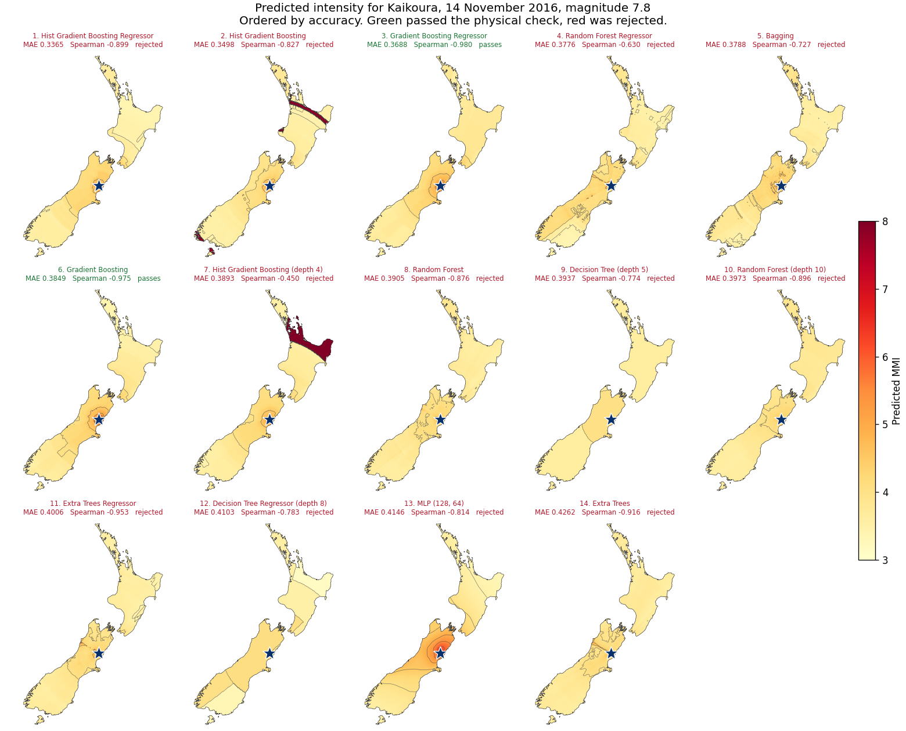

# Intensity Prediction Equation from GeoNet Felt RAPID Reports

Predicting Modified Mercalli Intensity (MMI) from crowdsourced earthquake shaking reports, using GeoNet's Felt RAPID Report data for New Zealand.

### Full analysis: [notebooks/](notebooks/)

The four notebooks run end to end from the public GeoNet APIs. Nothing is read from a pre-prepared file.

## The problem

Intensity prediction equations estimate how strongly an earthquake is felt at a given location, which supports rapid post-event assessment and earthquake risk modelling.

GeoNet's Felt RAPID Report survey asks the public which of six cartoons best matches what they experienced, mapping to MMI 3 through 8. This project asks whether that crowdsourced data alone can produce a usable and physically sensible intensity prediction equation.

## Approach

- 99 earthquakes and 609,476 felt reports pulled from the public GeoNet APIs, magnitude 4.0 to 8.0, October 2016 to December 2025.
- Reports aggregated to a 1 km grid built in NZTM2000 rather than in degrees, so cells are genuinely 1 km on a side. 24,241 cells survive a minimum of 5 reports each.
- Rather than collapsing each cell to a single intensity, every reported level is kept as a weighted training row. This avoids choosing between mean, median and mode, avoids tie-breaking, and keeps every label a real integer report.
- Features span three groups: physical (magnitude, depth, log hypocentral distance), directional (azimuth), and reporting behaviour (local time of day, weekend). Vs30 site conditions are optional.
- Splits are by earthquake rather than by row, and stratified by magnitude. Most features are properties of an event, so 24,241 cells carry only 95 independent observations of them.
- 44 models compared on identical terms, then screened for physical plausibility.

## Physical sanity check

A model can score well on held out data and still be wrong in a way no metric catches. Shaking must weaken with distance from an earthquake, but nothing in a loss function says so.

Holding an earthquake fixed and sweeping distance outwards shows that only 2 of the 14 most accurate models produce physically possible attenuation. The model with the best metrics is among the failures: its predictions do not fall reliably with distance, so its shake maps would mislead.

Selecting on physics first costs about 10% of accuracy for a model with output that makes physical sense.



Green passed, red was rejected. Two of these fourteen are usable.

## Results

Selected model: Gradient Boosting Regressor. The most accurate of all 44,
Hist Gradient Boosting Regressor, is rejected below.

| | Selected | Most accurate | Attenuation equation | Constant |
|---|---:|---:|---:|---:|
| Cell MAE | 0.369 | 0.337 | 0.545 | 0.590 |
| Worst Spearman | -0.980 | -0.899 | -1.000 | n/a |
| Physically plausible | yes | no | yes | no |


### No model can name damaging shaking, but the leaders can rank it

MMI 7 and above is 1.3% of reports, so the most likely single level is essentially never 7 or 8 and per-class recall reads as zero for every candidate. Measured as a ranking problem instead, the leading models reach ROC AUC around 0.79 to 0.80 for identifying MMI 6 and above. They rank damaging cells higher; they just cannot name them.

The contact sheet above shows the same thing from another angle: most panels stay pale even at the epicentre of a magnitude 7.8 earthquake, because most of these models never predict strong shaking anywhere. Precision is capped by the base rate rather than by ranking quality, which is the clearest argument in this project for bringing instrumental measurements alongside felt reports.

## Notebooks

| # | Notebook | What it covers |
|---|---|---|
| 1 | [01_data_acquisition.ipynb](notebooks/01_data_acquisition.ipynb) | Rebuilding the dataset from the GeoNet APIs, and the data quality problems found |
| 2 | [02_exploratory_analysis.ipynb](notebooks/02_exploratory_analysis.ipynb) | Gridding, the target decision, and what the data does and does not contain |
| 3 | [03_model_comparison.ipynb](notebooks/03_model_comparison.ipynb) | 44 models on identical terms, and why the standard metric had to be replaced |
| 4 | [04_physical_validation.ipynb](notebooks/04_physical_validation.ipynb) | Screening for physically possible attenuation, and the final selection |

Start with [04](notebooks/04_physical_validation.ipynb) if you only read one.

## Maps

`python src/maps.py` regenerates every shake map into [maps/](maps/):

- [contact-sheet.png](maps/contact-sheet.png), all fourteen candidates on one page
- [selected-vs-rejected.png](maps/selected-vs-rejected.png), the two that matter side by side
- [maps/models/](maps/models/), one map per candidate in accuracy order

All are drawn for the same earthquake on the same fixed MMI scale, so the panels can be compared directly. Predictions are masked to land using a simplified Natural Earth coastline committed under [assets/](assets/), so the maps render offline like everything else here.

## Data quality problems worth noting

Five were found and handled, each documented in the notebooks:

- Teleseismic events. The GeoNet catalogue lists earthquakes New Zealand instruments detected, not New Zealand earthquakes. Filtering removes 72% of raw entries, including events in Chile and Japan.
- Reports filed from outside New Zealand. 88 locations in Australia, the United Kingdom, Spain, the Netherlands and the Philippines. Real people, but not New Zealand shaking.
- Null Island. 34 reporting locations at exactly longitude 0.005, latitude 0.003, carrying 469 reports. Failed geolocation defaulting to the coordinate system origin.
- Out-of-scale intensities. The survey produces MMI 3 to 8, but the archive holds a handful of MMI 1 and 2 reports.
- Event misattribution during aftershock sequences. Magnitude 4 to 5 events appear to produce rising intensity with distance, which is impossible. The far-field cells trace to two November 2016 Kaikoura aftershocks, where people could not tell which shake they were reporting.

## Repository layout

```
src/         pipeline modules: ingest, clean, features, models, bench, spatial, maps
notebooks/   the analysis, four notebooks in order
tests/       153 tests, one file per module, entirely offline
maps/        rendered shake maps, one per candidate
assets/      simplified NZ coastline, for masking maps to land
```

## Running it

```bash
pip install -r requirements-notebooks.txt
pytest tests/
jupyter notebook notebooks/
```

`requirements.txt` is what the pipeline and the tests need, and is what CI installs. `requirements-notebooks.txt` adds Jupyter on top.

Run the notebooks in order. Notebook 01 fetches from the GeoNet APIs and caches responses under `data/raw`, so later runs do not hit the API again. No data is committed to this repository.

Vs30 site condition data is not redistributed here, because the source grid's terms are unconfirmed. It is genuinely optional: `model_features` drops any feature the data cannot supply, so a clone without it trains on the remaining eight and every model in the bench still fits. Partial gaps are a different case and are filled with the median of the cells that did match, flagged so a filled value is never mistaken for a measured one.


## Context

This is a full rebuild, written independently, of a problem first worked on as a DATA601 research project at the University of Canterbury with Zheng Chao, supervised by Hazel Fraser and Goldie Leung. The pipeline, the analysis and the results here are my own, and differ substantially from that original work.

## Data source

[GeoNet Felt RAPID Reports](https://api.geonet.org.nz/) and the [GeoNet quake search API](https://quakesearch.geonet.org.nz/), both publicly available. Coastline from [Natural Earth](https://www.naturalearthdata.com/), public domain.

## License

[MIT](LICENSE). GeoNet data is published by GNS Science under CC BY 4.0.
